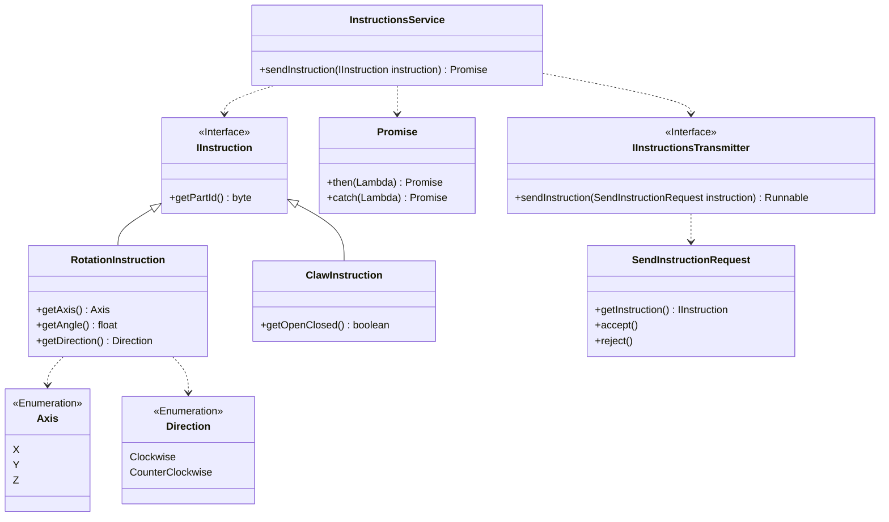
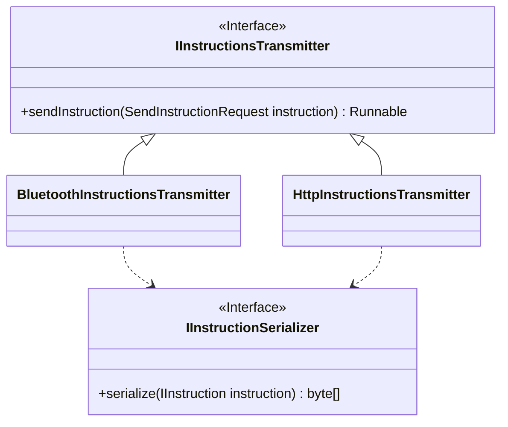
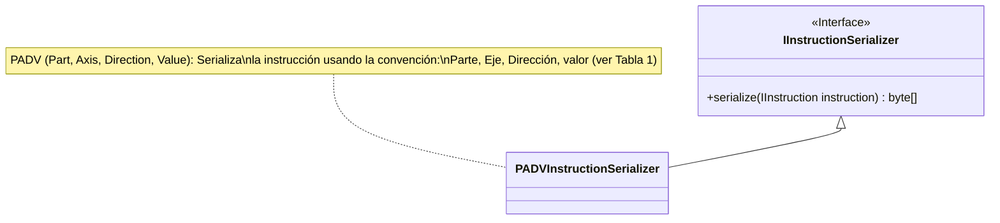
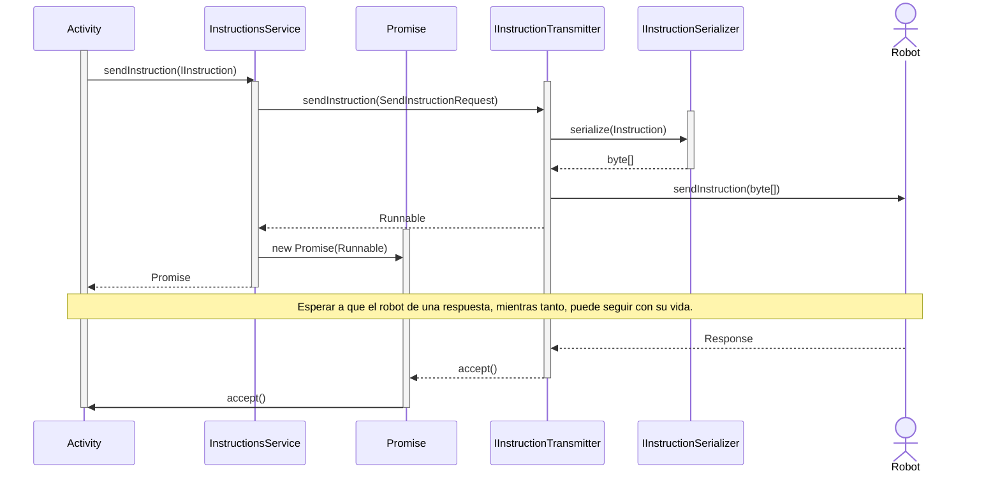

# Aplicativo móvil para el control de brazo robótico

## Introducción

Se quiere construir un aplicativo móvil que permita el control de un brazo robótico, de tal manera que se pueda enviar movimientos por medio de scripts que manipulen los nodos del brazo robótico.

Texto adicional sobre la introducción y detalles del proyecto...

## Movimiento en grados o tiempo para un brazo de tres grados de libertad

A continuación, se detallan los movimientos para un brazo de tres grados de libertad:

**Tabla 1**

_Esquema de un mensaje de movimiento (instrucción)_

| Parte del brazo | Eje | Sentido en las manecillas del reloj | Grados/Tiempo |
| --------------- | --- | ----------------------------------- | ------------- |
| Base            | z   | A favor                             | 90            |
| Brazo           | y   | En contra                           | 45            |
| Antebrazo       | x   | En contra                           | 90            |
| Pinza           | on/off | on/off                             | on/off        |

## Diagrama de las partes del brazo

## Diagrama de componentes de la App

## Diagramas de clases de la App

A continuación, aparecen los diagramas de clase de algunos componentes:

### Modelo de instrucciones

### Transmisión de instrucciones

### Serialización de Instrucciones

## Diagramas de secuencia

## Tecnologías Utilizadas 🚀

- Android 📱
- Java ☕
- Canva 🎨
- Diagramas Draw ✏️
- Lucid Charts
- Mermaid

## Autor

- **Javier Jaramillo**
- **Jeysson Guevara**
